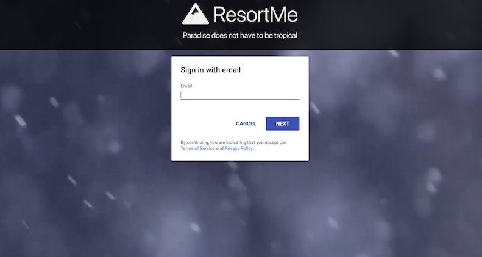
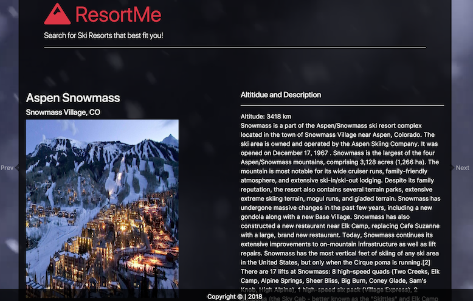
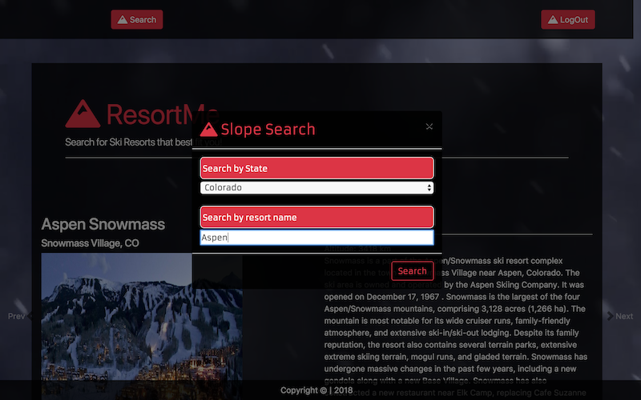

# Project-2 ResortMe 
This app was built by : Drew G, Nick C, Jay M, and Brian M

Welcome to ResortMe: an application to help you plan your next skiing getaway.

Resort Me allows the user to search and find results from every ski resort located in the United States.

The user will first hit the login page where they can create login information or login with a pre-existing email and password.

After the user submits the login, they will be re-directed to the main page. 

This main page displays some of the most popular ski resorts in the country and will also allow the user to search for any other ski resorts in the US.

When the user clicks the search button, a modal will appear, in which they can search by state or by resort name. The user will input the desired parameters and then click the search button in the bottom of the modal. 

The app will then search our MySQL database containing the resort information and display all the search results in the body of our main page.